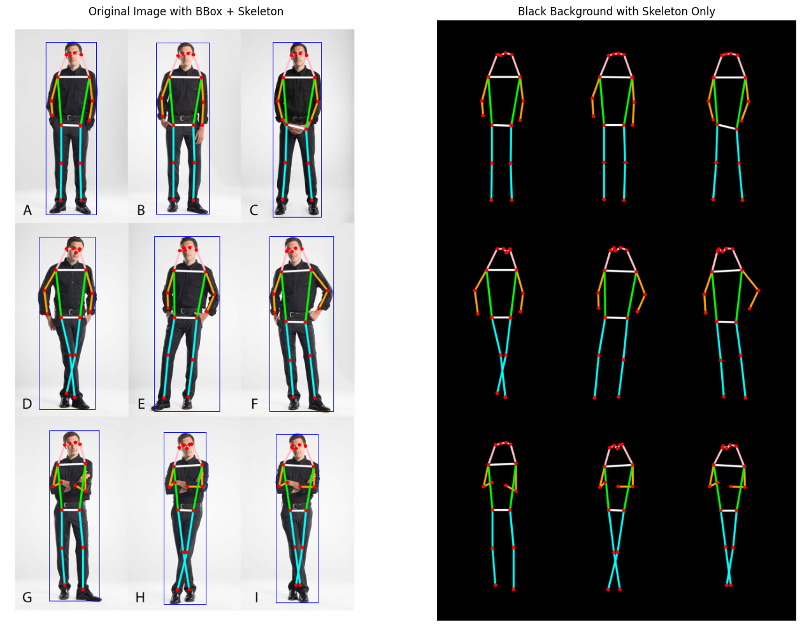
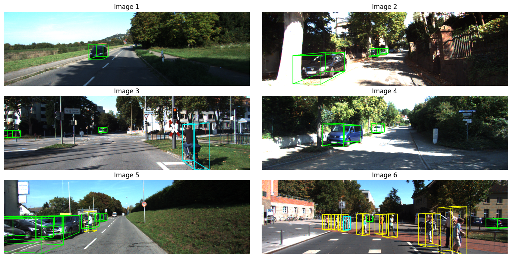

    <h1>Pose Estimation and 2D 3D Object Detection using CenterNet</h1>

  
  

---

## 🏗️ Methodology

- 𖥠 Pose Estimation Model: **multi_pose_dla_3x.pth**
- 𖥠 2D Object Detection Model: **ctdet_coco_dla_2x.pth**
- 𖥠 3D Object Detection Model: **ddd_3dop.pth**
- 𖥠 Framework: **PyTorch + DCNv2**

---

## ⭐ Acknowledgements

- CenterNet powered by `DCNv2`
- KITTI Dataset

---
